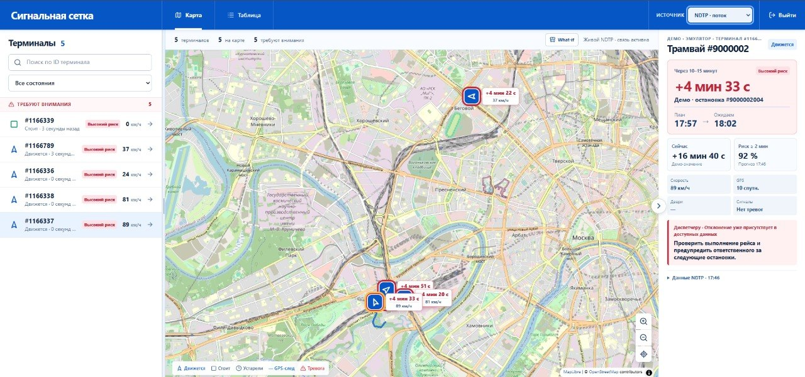
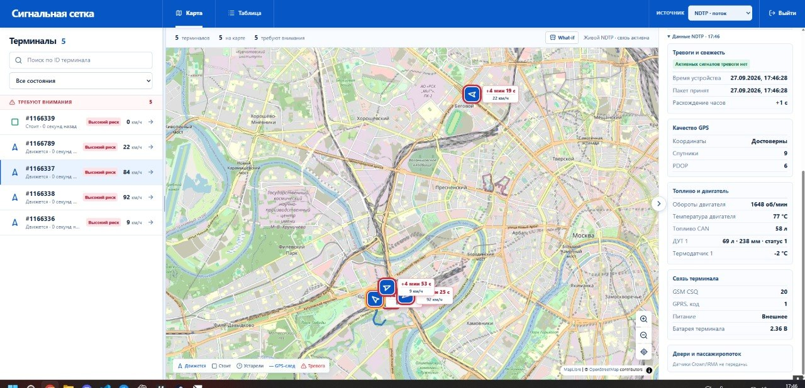
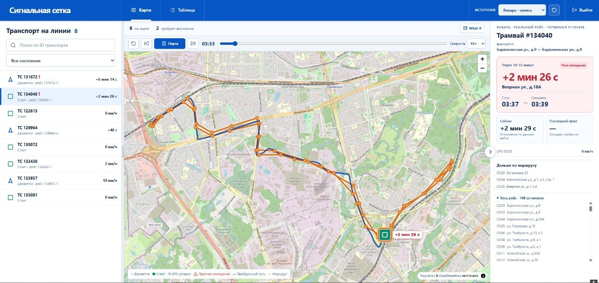

# Предиктор отклонений городского транспорта

Система принимает телеметрию NDTP по TCP, выбирает первую плановую остановку в
интервале **(T + 10 минут, T + 15 минут]** и прогнозирует отклонение от расписания
в секундах. Диспетчер видит транспорт, прогнозы и инциденты в дашборде.

## Один запуск

Нужны Docker с Compose, Python 3.12+ и GNU Make. Для запуска с нуля положите
архив эмулятора организаторов в `emulator/ndtp-telemetry-emulator.tar` и
подготовьте конкурсные CSV в `data/raw/`. Архив и большие данные не входят в Git;
полный список входных файлов приведён в [инструкции по запуску](ЗАПУСК.md).

Из корня репозитория, если файла `.env` ещё нет, выполните:

```bash
cp .env.example .env
make up
```

Команда собирает и запускает PostgreSQL, ML, Backend и Frontend, подключает
официальный NDTP-эмулятор и проверяет получение пакетов, прогнозов и инцидентов.
В том же дашборде Backend загружает январскую запись из CSV. Для просмотра
обоих источников не нужны дополнительные команды или перезапуск.

Откройте <http://localhost:8080> и войдите как `dispatcher` / `transport`.
В верхнем переключателе доступны:

- **NDTP · поток** — живая синтетическая телеметрия пяти терминалов эмулятора,
  прошедшая по TCP через Backend и ML;
- **Январь · запись** — исторический день из CSV с управлением временем и
  расчётом прогнозов по январским точкам.

Живой поток эмулятора проверяет интеграцию; оценка точности модели относится к
размеченным конкурсным данным. Для показа проекта используйте
[инструкцию для жюри](docs/ИНСТРУКЦИЯ-ДЛЯ-ЖЮРИ.md).

<table>
  <tr>
    <td align="center" width="33%"><strong>Прогноз и активный инцидент</strong></td>
    <td align="center" width="33%"><strong>Принятая NDTP-телеметрия</strong></td>
    <td align="center" width="33%"><strong>Исторический рейс и прогноз</strong></td>
  </tr>
  <tr>
    <td></td>
    <td></td>
    <td></td>
  </tr>
</table>

## Конкурсный результат

Выбранная модель — LightGBM plan, `lightgbm-plan-2026-09-26`. Локальная MAE на
353 размеченных test-точках: **58,6033 с** против **93,3598 с** у baseline
`cur_dev_s`. Файл `data/submissions/final_submission.csv` содержит 151 прогноз
в формате `sample_id;prediction`.
